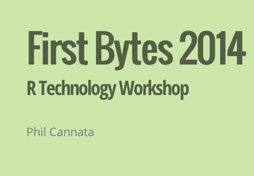
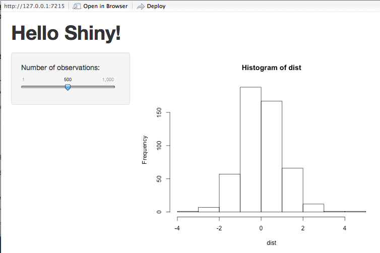
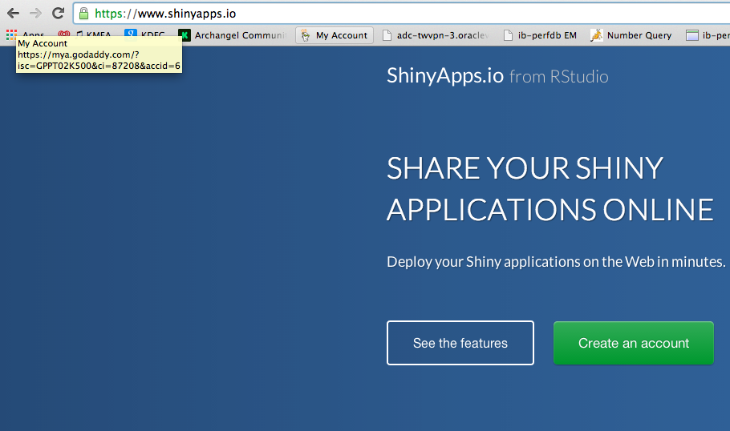
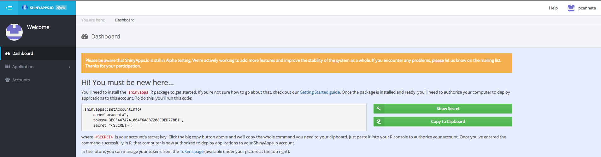
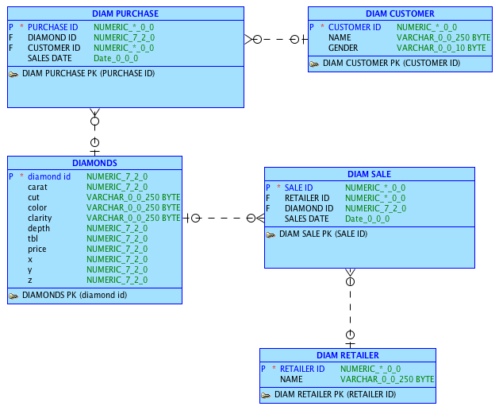
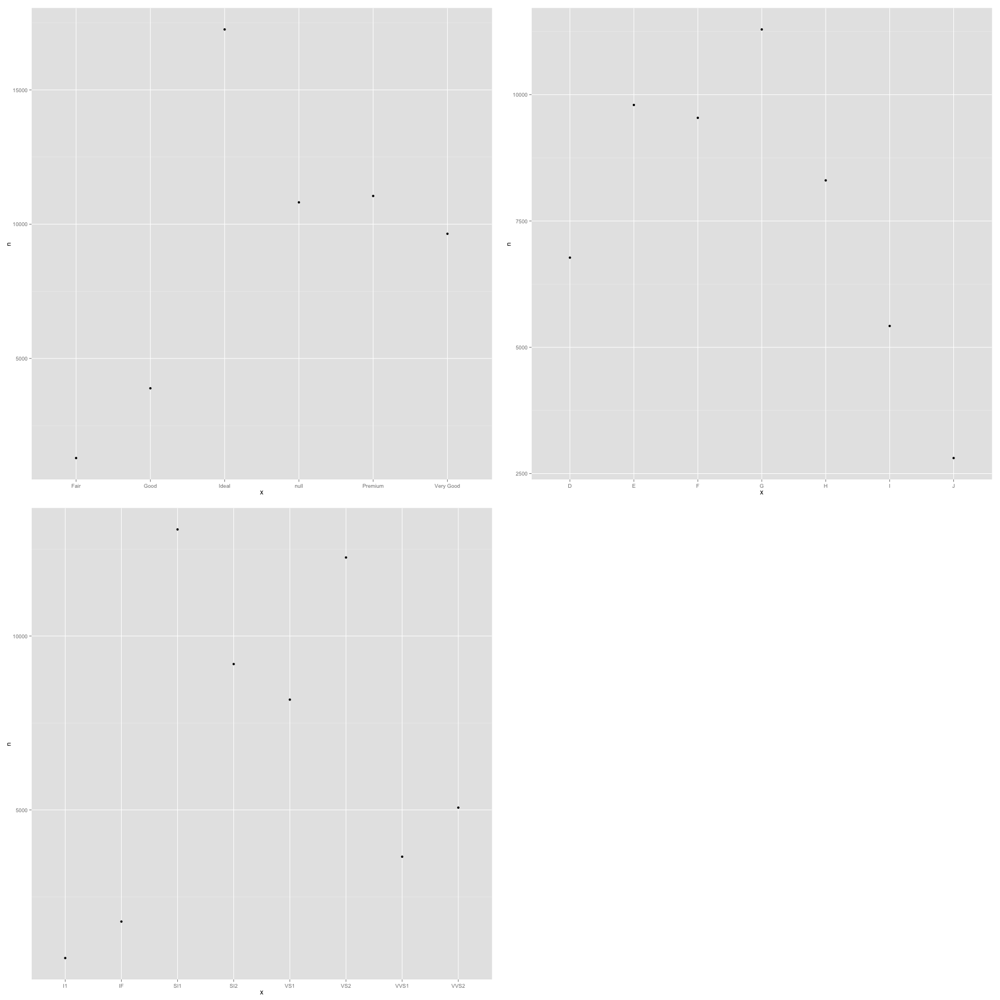
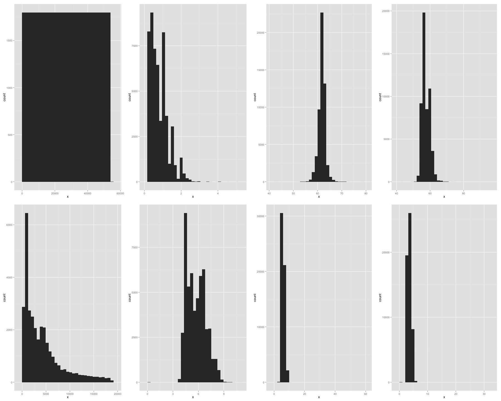

---
output:
  pdf_document: default
  html_document:
    pandoc_args:
    - +RTS
    - -K64m
    - -RTS
---
R Technology Workshop
===
**R is the most popular free software environment for statistical computing and graphics. ggplot2 is a data visualization package for R that can be used to produce publication-quality graphics. This workshop is designed to introduce you to R and ggplot as well as RStudio, KnitR, Slidify, and Shiny.  
R is a central piece of the Big Data Analytics Revolution, for example, see http://opensource.com/business/14/7/interview-david-smith-revolution-analytics for an article entitled "Big data influencer on how R is paving the way"**

###This is how my RStudio is configured:
```{r}
sessionInfo()
```

You also need to install LaTeX if you want to generate PDF files from KnitR.  

 http://latex-project.org/ftp.html

###Getting Started - Clone the RWorkshop GiT Repository:

Use a GUI tool like SourceTree to clone the repository or execute the following commands in a terminal window:

**Phils-MacBook-Pro:Mine pcannata$ pwd**  
/Users/pcannata  
**Phils-MacBook-Pro:~ pcannata$ git clone https://github.com/pcannata/DataVisualization.git**  
Cloning into 'DataVisualization'...
remote: Counting objects: 74, done.
remote: Compressing objects: 100% (60/60), done.
remote: Total 74 (delta 6), reused 67 (delta 4)
Unpacking objects: 100% (74/74), done.
Checking connectivity... done.  
**Phils-MacBook-Pro:~ pcannata$ ls -a DataVisualization/**  
.  	..		.git		README.md	RWorkshop

###Getting Started - Create a New RStudio Project for the code in the cloned repository:

  

  

  

    

###Getting Started - Create a .Rprofile file to load libraries when the project is started: 

Create an new file text named .Rprofile.

Put the following into .Rprofile  
require("ggplot2") 
require("ggthemes") 
require("gplots") 
require("grid") 
require("RCurl") 
require("reshape2") 
require("rstudio") 
require("tableplot") 
require("tidyr") 
require("dplyr") 
require("jsonlite") 
require("extrafont") 
require("lubridate")  

##Be sure to put a newline after the last require statement. 

###Recommended Books:

   
http://www.amazon.com/Everyone-Advanced-Analytics-Graphics-Addison-Wesley/dp/0321888030/ref=sr_1_1?ie=UTF8&qid=1404611818&sr=8-1&keywords=R+for+everyone 

###00 KnitR Overview
**KnitR is an R package designed to generate dynamic reports using a mix of the R, LaTex, and the Rmarkdown (see http://rmarkdown.rstudio.com/?version=0.98.945&mode=desktop) languages.**  

See also http://yihui.name/knitr/ and http://kbroman.github.io/knitr_knutshell/

**Simple examples can be found in "04 KnitR/doc1.Rmd" and "04 KnitR/doc2.Rmd". These can generate html, pdf, and word documents. The output from Kniting doc2.Rmd is,**  

 

####A comprehensive KnitR example (which generated this document) can be found in "00 Doc/RWorkshop.Rmd".  

http://www.amazon.com/Reproducible-Research-Studio-Edition-Chapman/dp/1498715370/ref=dp_ob_title_bk 

###00 High Level Overview - Creating an Excel-like Chart in R - see the 00 Overview Folder in the DrCannata/Rworkshop Repository  

This is something that is easily done in Excel: 

 

How would you do the same thing in R? 

```{r}
source("../00 Overview/Overview.R", echo = TRUE)
```

See also http://cran.r-project.org/doc/manuals/r-devel/R-lang.html, http://www.r-tutor.com/r-introduction, and http://www.cookbook-r.com/

###01 R Dataframes - see the 02 R Dataframes Folder in the DrCannata/Rworkshop Repository  

**A data frame is used for storing data tables. It is a list of vectors of equal length. For example, the following variable df is a data frame containing three vectors n, s, b.**

```{r}
n = c(2, 3, 5) 
s = c("aa", "bb", "cc") 
b = c(TRUE, FALSE, TRUE) 
df = data.frame(n, s, b)       # df is a data frame
head(df)
``` 

Dataframes can be loaded from databases, CSVs, Excel, etc.. Loading dataframes from an Oracle database will be discussed later in this Workshop.

See also http://www.r-tutor.com/r-introduction/data-frame

Many R packages come with demo dataframes. The ggplot package comes with a demo dataframe called diamonds which we will use for this workshop.

```{r}
source("../01 R Dataframes/Dataframes.R", echo = TRUE)
```
For more on subsetting dataframes see http://www.ats.ucla.edu/stat/r/faq/subset_R.htm

###02 RESTful Data Access

```{r}
source("../02 RESTful Data Access/Access Oracle Database.R", echo = TRUE)
```

###03 Grammar of Graphics with R & ggplot2
**ggplot is an R package for data exploration and visualization. It produces production quality graphics and allows you to slice and dice your data in many different ways. ggplot uses a general scheme for data visualization which breaks graphs up into semantic components such as scales and layers. In contrast to other graphics packages, ggplot2 allows the user to add, remove or alter components in a plot at a high level of abstraction.**

See also http://ggplot2.org/, http://cran.r-project.org/web/packages/ggplot2/ggplot2.pdf, and https://groups.google.com/forum/#!forum/ggplot2 

###Grammar of Graphics 

plot ::= [coord](http://sape.inf.usi.ch/quick-reference/ggplot2/coord)  [scale+](http://sape.inf.usi.ch/quick-reference/ggplot2/scale) [facet?](http://sape.inf.usi.ch/quick-reference/ggplot2/facet)   [label?](https://www.rstudio.com/wp-content/uploads/2015/08/ggplot2-cheatsheet.pdf)  [theme?](http://docs.ggplot2.org/current/theme.html) layer+  
layer ::= data [mapping](http://www.cs.utexas.edu/~cannata/dataVis/R%20Cheat%20Sheets/aes.txt) [stat](http://sape.inf.usi.ch/quick-reference/ggplot2/stat) [geom](http://sape.inf.usi.ch/quick-reference/ggplot2/geom) [position?](http://sape.inf.usi.ch/quick-reference/ggplot2/position)  

```{r}
source("../03 Grammar of Graphics with R & ggplot2/Grammar Examples.R", echo = TRUE)
```

**The Chapter 7 of "R for Everyone" has many more examples of ggplots.**

###ggplot2 and functions

```{r}
# source("../03 Grammar of Graphics with R & ggplot2/plotFunction.R", echo = TRUE)
```

**You should now be able to open RWorkshop/00 Doc/4diamonds.png. It should look like the following plot.**

 

###slidify
**You can use Slidify to generate HTML slide decks using only the Rmarkdown language.**  

See also http://slidify.org and http://slidify.org/start.html

**Follow the instructions in "05 Slidify/slidify setup.R" to install and run slidify. You should be able to produce a slide deck with a first slide that looks something like the following.** 

  

**Cool trick - Any github repo with a branch called gh-pages will get served as a website. If the content of that repo is the stuff of websites (html,css), then you get free web hosting. So, create a branch called gh-pages and push to it.**  

###shiny
**The shiny R package allows you to build interactive web-based applications using only R with no knowledge of html, css, or javascript needed. You just need to write two scripts (see the example files in the 06Shiny directory):**  

* ui.R : Defines the layout and the interactive elements that the user can access.  
* server.R : Defines what computations are done in response to user interactions. 

See also http://shiny.rstudio.com and http://shiny.rstudio.com/tutorial 

To run the shiny app that's in the 06Shiny directory run the following in the main RWorkshop directory (make sure the working directory is set to this directory):  
library(shiny)  
runApp("06Shiny")   # Make sure there are no spaces in the string argument to runAPP

This should pop the application up in a browser, you can also access it in a browser at http://127.0.0.1:6837. It should look like the following.

 

###shinyapps

The example above ran the shiny app on your local machine, but to share with others, you have to send around the R files and the user needs to have R and know a little bit about it.

Instead, you can remotely host shiny apps and then just send people links. Get a free account at shinyapps.io/signup.html and give it a try.





**library("devtools", lib.loc="/Library/Frameworks/R.framework/Versions/3.0/Resources/library")  
install_github( repo = "shinyapps", username="rstudio" )  
shinyapps::setAccountInfo(name='pcannata', token='3ECF447A741004F6A8B7208C9ED778E1', secret='. . . ')**  

```{r}
# library(shinyapps)
getwd()
# Uncomment the following line to deploy the app.
#deployApp("../06Shiny")
```

**Now you can try the app at https://pcannata.shinyapps.io/06Shiny/ **  

See also https://www.shinyapps.io/ and http://shiny.rstudio.com/articles/shinyapps.html 

###Data Wrangling

See also http://cran.r-project.org/doc/manuals/r-devel/R-lang.html, http://www.r-tutor.com/r-introduction, and http://www.cookbook-r.com/

```{r}
# source("../07 Data Wrangling/Data Wrangling.R", echo = TRUE)

```
http://www.rstudio.com/resources/cheatsheets/ 

###Type of RestfulReL Oracle Cloud Connections

```{r}
# source("../08 eval(parse vs. json/ParseEval vs JSON.R", echo = TRUE)
```

###Joining Data



```{r}
# source("../09 Joining Data/Joining Data.R", echo = TRUE)
```
http://www.rstudio.com/resources/cheatsheets/

###Lists Indexing

```{r}
# source("../10 ListsForIfFunctionsPng/List Indexing.R", echo = TRUE)
```
  
For more details on [[...]], see http://stackoverflow.com/questions/1169456/in-r-what-is-the-difference-between-the-and-notations-for-accessing-the

###Lists, For and If Statements, Functions, and generating png Files

```{r}
# source("../10 ListsForIfFunctionsPng/ListsForIfFunctionsPng.R", echo = TRUE)
```

 
 

###Beautiful Plotting  
Based upon http://www.cs.utexas.edu/~cannata/dataVis/Class%20Notes/Beautiful%20plotting%20in%20R_%20A%20ggplot2%20cheatsheet%20_%20Technical%20Tidbits%20From%20Spatial%20Analysis%20&%20Data%20Science.pdf  

```{r}
# source("../11 Beautiful Plotting/Beautiful Plotting.R", echo = TRUE)
```

###Bokey  
Based upon http://hafen.github.io/rbokeh/  

```{r}
# source("../12 Bokeh/Bokeh.R", echo = TRUE)
```


