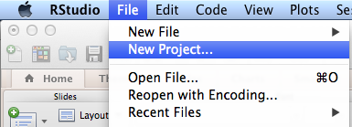
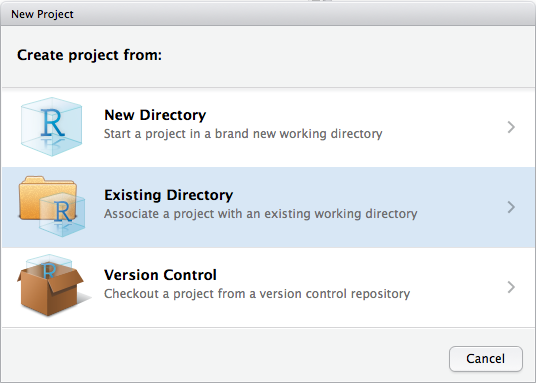
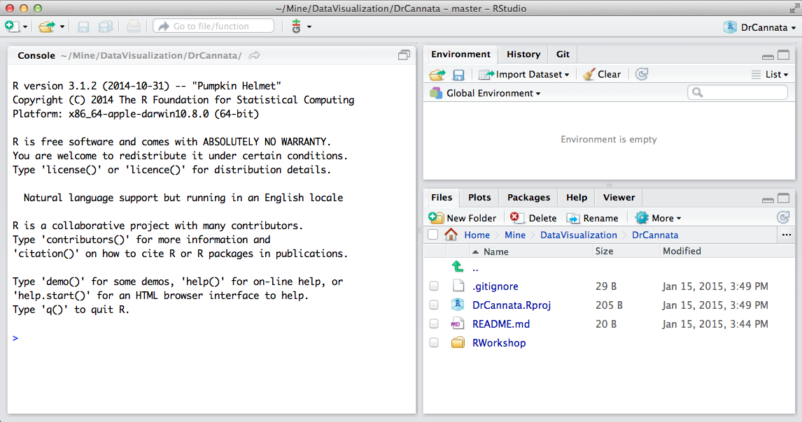
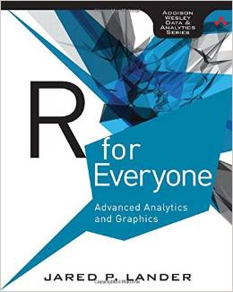
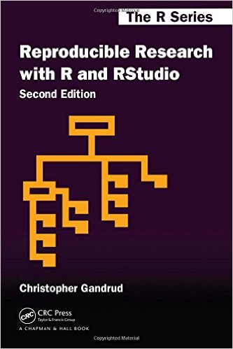
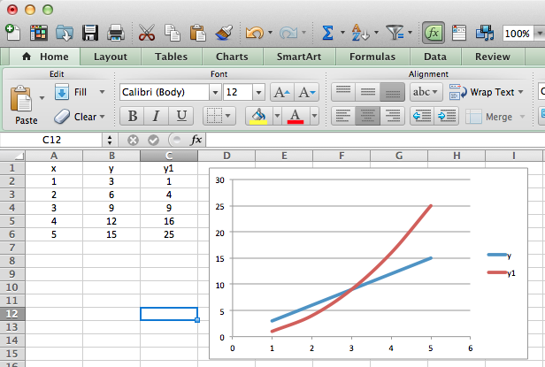

R Technology Workshop
===
**R is the most popular free software environment for statistical computing and graphics. ggplot2 is a data visualization package for R that can be used to produce publication-quality graphics. This workshop is designed to introduce you to [R](https://www.rstudio.com/wp-content/uploads/2016/06/r-cheat-sheet.pdf), [ggplot](https://www.rstudio.com/wp-content/uploads/2015/12/ggplot2-cheatsheet-2.0.pdf) and [R Markdown](https://www.rstudio.com/wp-content/uploads/2016/03/rmarkdown-cheatsheet-2.0.pdf) as well as [RStudio](https://www.rstudio.com/wp-content/uploads/2016/01/rstudio-IDE-cheatsheet.pdf), [KnitR](http://yihui.name/knitr/), [Data Wrangling](https://www.rstudio.com/wp-content/uploads/2015/02/data-wrangling-cheatsheet.pdf), and [Shiny](https://www.rstudio.com/wp-content/uploads/2016/01/shiny-cheatsheet.pdf).  
R is a central piece of the Big Data Analytics Revolution, for example, see [Big data influencer on how R is paving the way](http://opensource.com/business/14/7/interview-david-smith-revolution-analytics).**

###This is how my RStudio is configured:
```{r}
sessionInfo()
```

You also need to install LaTeX if you want to generate PDF files from KnitR.
 http://latex-project.org/ftp.html

###Getting Started - Clone the RWorkshop GiT Repository:

Use a GUI tool like SourceTree to clone the repository or execute the following commands in a terminal window:

**Phils-MacBook-Pro:Mine pcannata$ pwd**  
/Users/pcannata  
Phils-MacBook-Pro:~ pcannata$ git clone https://github.com/pcannata/DataVisualization.git  
Cloning into 'DataVisualization'...
remote: Counting objects: 74, done.
remote: Compressing objects: 100% (60/60), done.
remote: Total 74 (delta 6), reused 67 (delta 4)
Unpacking objects: 100% (74/74), done.
Checking connectivity... done.  
**Phils-MacBook-Pro:~ pcannata$ ls -a DataVisualization/**  
.  	..		.git		README.md	RWorkshop

###Getting Started - Create a New RStudio Project for the code in the cloned repository:

  

  

  

    

###Getting Started - Create a .Rprofile file to load libraries when the project is started: 

Create an new file text named .Rprofile.

Put the following into .Rprofile  
require("ggplot2")  
require("ggthemes")  
require("gplots")  
require("grid")  
require("RCurl")  
require("reshape2")  
require("rstudio")  
require("tableplot")  
require("tidyr")  
require("dplyr")  
require("jsonlite")  
require("extrafont")  
require("lubridate")   

**Be sure to put a newline after the last require statement.** 

###Recommended Books:

<div style="width:200px; height=300px">
 
</div>
[R for Everyone](http://www.amazon.com/Everyone-Advanced-Analytics-Graphics-Addison-Wesley/dp/0321888030/ref=sr_1_1?ie=UTF8&qid=1404611818&sr=8-1&keywords=R+for+everyone)  

<div style="width:200px; height=300px">

</div>
[Reproducible Research](https://www.amazon.com/Reproducible-Research-Studio-Second-Chapman/dp/1498715370/ref=sr_1_1?ie=UTF8&qid=1472867047&sr=8-1&keywords=reproducible+research)  

<div style="width:200px; height=300px">
 
</div>
[ggplot2](https://www.amazon.com/dp/0387981403/ref=cm_sw_su_dp?tag=ggplot2-20)    

###KnitR Overview:
**KnitR is an R package designed to generate dynamic reports using a mix of the R, LaTex, and the [Rmarkdown](http://rmarkdown.rstudio.com/?version=0.98.945&mode=desktop) languages (see also [R Markdown Cheat Sheet](https://www.rstudio.com/wp-content/uploads/2016/03/rmarkdown-cheatsheet-2.0.pdf)).**  

See also [knitr](http://yihui.name/knitr/), and [knitr in a knutshell a minimal tutorial](http://kbroman.github.io/knitr_knutshell/)

**Simple examples can be found in "00 KnitR/doc1.Rmd" and "00 KnitR/doc2.Rmd". These can generate html, pdf, and word documents. The output from Kniting doc2.Rmd is,**  

 

####A comprehensive KnitR example (which generated this document) can be found in "00 Doc/RWorkshop.Rmd".  

###00 High Level Overview - Creating an Excel-like Chart in R - see the 00 Overview Folder in the Rworkshop Repository  

This is something that is easily done in Excel: 

 

How would you do the same thing in R? 

```{r}
source("../00 Overview/Overview.R", echo = TRUE)
```

See also http://cran.r-project.org/doc/manuals/r-devel/R-lang.html, http://www.r-tutor.com/r-introduction, and http://www.cookbook-r.com/

###01 R Dataframes - see the 01 R Dataframes Folder in the Rworkshop Repository  

**A data frame is used for storing data tables. It is a list of vectors of equal length. For example, the following variable df is a data frame containing three vectors n, s, b.**

```{r}
n = c(2, 3, 5) 
s = c("aa", "bb", "cc") 
b = c(TRUE, FALSE, TRUE) 
df = data.frame(n, s, b)       # df is a data frame
head(df)
``` 

Dataframes can be loaded from databases, CSVs, Excel, etc.. Loading dataframes from an Oracle database will be discussed later in this Workshop.

See also http://www.r-tutor.com/r-introduction/data-frame

Many R packages come with demo dataframes. The ggplot package comes with a demo dataframe called diamonds, which we will use for this workshop.

```{r}
source("../01 R Dataframes/Dataframes.R", echo = TRUE)
```
For more on subsetting dataframes see http://www.ats.ucla.edu/stat/r/faq/subset_R.htm

###02 RESTful Data Access - see the 02 RESTful Data Access Folder in the Rworkshop Repository  

```{r}
source("../02 RESTful Data Access/Access Oracle Database.R", echo = TRUE)
```

###03 Grammar of Graphics with R & ggplot2
**ggplot is an R package for data exploration and visualization. It produces production quality graphics and allows you to slice and dice your data in many different ways. ggplot uses a general scheme for data visualization which breaks graphs up into semantic components such as scales and layers. In contrast to other graphics packages, ggplot2 allows the user to add, remove or alter components in a plot at a high level of abstraction.**

See also http://ggplot2.org/, http://cran.r-project.org/web/packages/ggplot2/ggplot2.pdf, and https://groups.google.com/forum/#!forum/ggplot2 

###Grammar of Graphics  
[Data Visualization Cheat Sheet](https://www.rstudio.com/wp-content/uploads/2015/12/ggplot2-cheatsheet-2.0.pdf), 
[ggplot2 Quick Reference](http://sape.inf.usi.ch/quick-reference/ggplot2)  

plot ::=  ggplot() + [coord?](http://sape.inf.usi.ch/quick-reference/ggplot2/coord) + [scale*](http://sape.inf.usi.ch/quick-reference/ggplot2/scale) + [facet?](http://sape.inf.usi.ch/quick-reference/ggplot2/facet) + [label*](https://www.rstudio.com/wp-content/uploads/2015/08/ggplot2-cheatsheet.pdf) + [theme*](http://docs.ggplot2.org/current/theme.html) + layer+  

layer ::= data + [geom](http://sape.inf.usi.ch/quick-reference/ggplot2/geom) + [mapping](http://www.cs.utexas.edu/~cannata/dataVis/R%20Cheat%20Sheets/aes.txt)  + [stat](http://sape.inf.usi.ch/quick-reference/ggplot2/stat)  + [position?](http://sape.inf.usi.ch/quick-reference/ggplot2/position)  

```{r}
source("../03 Grammar of Graphics with R & ggplot2/Grammar Examples.R", echo = TRUE)
```

**The Chapter 7 of "R for Everyone" has many more examples of ggplots.**

###ggplot2 and functions

```{r}
# source("../03 Grammar of Graphics with R & ggplot2/plotFunction.R", echo = TRUE)
```

**You should now be able to open RWorkshop/00 Doc/4diamonds.png. It should look like the following plot.**

 

###slidify
**You can use Slidify to generate HTML slide decks using only the Rmarkdown language.**  

See also http://slidify.org and http://slidify.org/start.html

**Follow the instructions in "05 Slidify/slidify setup.R" to install and run slidify. You should be able to produce a slide deck with a first slide that looks something like the following.** 
