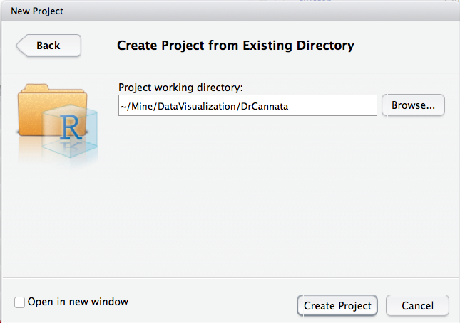
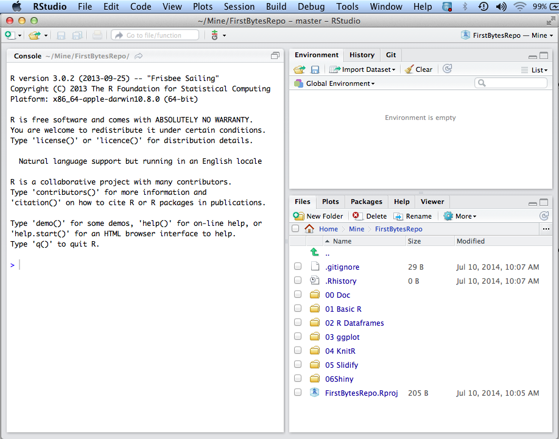
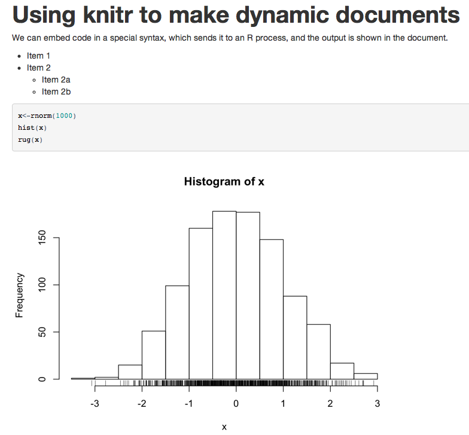
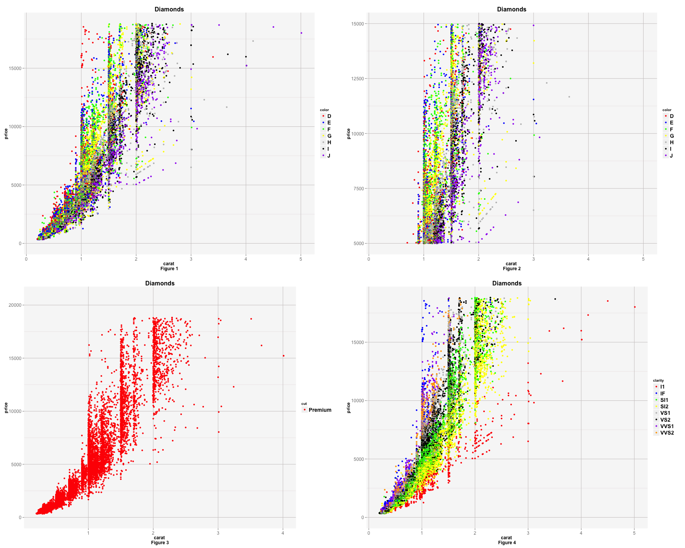

<!-- rmarkdown v1 -->
R Technology Workshop
===
**R is the most popular free software environment for statistical computing and graphics. ggplot2 is a data visualization package for R that can be used to produce publication-quality graphics. This workshop is designed to introduce you to R and ggplot as well as RStudio, KnitR, Slidify, and Shiny.  
R is a central piece of the Big Data Analytics Revolution, for example, see http://opensource.com/business/14/7/interview-david-smith-revolution-analytics for an article entitled "Big data influencer on how R is paving the way"**

###This is how my RStudio is configured:

```r
sessionInfo()
```

```
## R version 3.3.1 (2016-06-21)
## Platform: x86_64-apple-darwin13.4.0 (64-bit)
## Running under: OS X 10.11.6 (El Capitan)
## 
## locale:
## [1] en_US.UTF-8/en_US.UTF-8/en_US.UTF-8/C/en_US.UTF-8/en_US.UTF-8
## 
## attached base packages:
## [1] stats     graphics  grDevices utils     datasets  methods   base     
## 
## other attached packages:
## [1] knitr_1.14
## 
## loaded via a namespace (and not attached):
## [1] magrittr_1.5  tools_3.3.1   stringi_1.1.1 stringr_1.1.0 evaluate_0.9
```

You also need to install LaTeX if you want to generate PDF files from KnitR.
 http://latex-project.org/ftp.html

###Getting Started - Clone the RWorkshop GiT Repository:

Use a GUI tool like SourceTree to clone the repository or execute the following commands in a terminal window:

**Phils-MacBook-Pro:Mine pcannata$ pwd**  
/Users/pcannata  
**Phils-MacBook-Pro:~ pcannata$ git clone https://github.com/pcannata/DataVisualization.git**  
Cloning into 'DataVisualization'...
remote: Counting objects: 74, done.
remote: Compressing objects: 100% (60/60), done.
remote: Total 74 (delta 6), reused 67 (delta 4)
Unpacking objects: 100% (74/74), done.
Checking connectivity... done.  
**Phils-MacBook-Pro:~ pcannata$ ls -a DataVisualization/**  
.  	..		.git		README.md	RWorkshop

###Getting Started - Create a New RStudio Project for the code in the cloned repository:

  

  

  

    

###Getting Started - Create a .Rprofile file to load libraries when the project is started: 

Create an new file text named .Rprofile.

Put the following into .Rprofile  
require("ggplot2") 
require("ggthemes") 
require("gplots") 
require("grid") 
require("RCurl") 
require("reshape2") 
require("rstudio") 
require("tableplot") 
require("tidyr") 
require("dplyr") 
require("jsonlite") 
require("extrafont") 
require("lubridate")  

##Be sure to put a newline after the last require statement. 

###Recommended Books:

   
http://www.amazon.com/Everyone-Advanced-Analytics-Graphics-Addison-Wesley/dp/0321888030/ref=sr_1_1?ie=UTF8&qid=1404611818&sr=8-1&keywords=R+for+everyone 

###00 KnitR Overview
**KnitR is an R package designed to generate dynamic reports using a mix of the R, LaTex, and the Rmarkdown (see http://rmarkdown.rstudio.com/?version=0.98.945&mode=desktop) languages.**  

See also http://yihui.name/knitr/ and http://kbroman.github.io/knitr_knutshell/

**Simple examples can be found in "04 KnitR/doc1.Rmd" and "04 KnitR/doc2.Rmd". These can generate html, pdf, and word documents. The output from Kniting doc2.Rmd is,**  

 

####A comprehensive KnitR example (which generated this document) can be found in "00 Doc/RWorkshop.Rmd".  

http://www.amazon.com/Reproducible-Research-Studio-Edition-Chapman/dp/1498715370/ref=dp_ob_title_bk 

###00 High Level Overview - Creating an Excel-like Chart in R - see the 00 Overview Folder in the DrCannata/Rworkshop Repository  

This is something that is easily done in Excel: 

 

How would you do the same thing in R? 


```r
source("../00 Overview/Overview.R", echo = TRUE)
```

```
## 
## > x <- c(1, 2, 3, 4, 5)
## 
## > y <- 3 * x
## 
## > y1 <- 2^x
## 
## > x
## [1] 1 2 3 4 5
## 
## > y
## [1]  3  6  9 12 15
## 
## > y1
## [1]  2  4  8 16 32
## 
## > df <- data.frame(x, y, y1)
## 
## > df
##   x  y y1
## 1 1  3  2
## 2 2  6  4
## 3 3  9  8
## 4 4 12 16
## 5 5 15 32
## 
## > require(reshape2)
```

```
## Loading required package: reshape2
```

```
## 
## > mdf <- melt(df, id.vars = "x", measure.vars = c("y", 
## +     "y1"))
## 
## > mdf
##    x variable value
## 1  1        y     3
## 2  2        y     6
## 3  3        y     9
## 4  4        y    12
## 5  5        y    15
## 6  1       y1     2
## 7  2       y1     4
## 8  3       y1     8
## 9  4       y1    16
## 10 5       y1    32
## 
## > require(tidyr)
```

```
## Loading required package: tidyr
```

```
## 
## Attaching package: 'tidyr'
```

```
## The following object is masked from 'package:reshape2':
## 
##     smiths
```

```
## 
## > mdf <- gather(df, variable, value, -x)
## 
## > mdf
##    x variable value
## 1  1        y     3
## 2  2        y     6
## 3  3        y     9
## 4  4        y    12
## 5  5        y    15
## 6  1       y1     2
## 7  2       y1     4
## 8  3       y1     8
## 9  4       y1    16
## 10 5       y1    32
## 
## > require(ggplot2)
```

```
## Loading required package: ggplot2
```

```
## 
## > ggplot(mdf, aes(x = x, y = value, color = variable)) + 
## +     geom_line()
```


See also http://cran.r-project.org/doc/manuals/r-devel/R-lang.html, http://www.r-tutor.com/r-introduction, and http://www.cookbook-r.com/

###01 R Dataframes - see the 02 R Dataframes Folder in the DrCannata/Rworkshop Repository  

**A data frame is used for storing data tables. It is a list of vectors of equal length. For example, the following variable df is a data frame containing three vectors n, s, b.**


```r
n = c(2, 3, 5) 
s = c("aa", "bb", "cc") 
b = c(TRUE, FALSE, TRUE) 
df = data.frame(n, s, b)       # df is a data frame
head(df)
```

```
##   n  s     b
## 1 2 aa  TRUE
## 2 3 bb FALSE
## 3 5 cc  TRUE
```

Dataframes can be loaded from databases, CSVs, Excel, etc.. Loading dataframes from an Oracle database will be discussed later in this Workshop.

See also http://www.r-tutor.com/r-introduction/data-frame

Many R packages come with demo dataframes. The ggplot package comes with a demo dataframe called diamonds which we will use for this workshop.


```r
source("../01 R Dataframes/Dataframes.R", echo = TRUE)
```

```
## 
## > require("ggplot2")
## 
## > "Displaying the top few rows of a dataframe:"
## [1] "Displaying the top few rows of a dataframe:"
## 
## > head(diamonds)
## # A tibble: 6 × 10
##   carat       cut color clarity depth table price     x     y     z
##   <dbl>     <ord> <ord>   <ord> <dbl> <dbl> <int> <dbl> <dbl> <dbl>
## 1  0.23     Ideal     E     SI2  61.5    55   326  3.95  3.98  2.43
## 2  0.21   Premium     E     SI1  59.8    61   326  3.89  3.84  2.31
## 3  0.23      Good     E     VS1  56.9    65   327  4.05  4.07  2.31
## 4  0.29   Premium     I     VS2  62.4    58   334  4.20  4.23  2.63
## 5  0.31      Good     J     SI2  63.3    58   335  4.34  4.35  2.75
## 6  0.24 Very Good     J    VVS2  62.8    57   336  3.94  3.96  2.48
## 
## > "Summary of each variable in the dataframe."
## [1] "Summary of each variable in the dataframe."
## 
## > names(diamonds)
##  [1] "carat"   "cut"     "color"   "clarity" "depth"   "table"   "price"  
##  [8] "x"       "y"       "z"      
## 
## > `?`(diamonds)
## 
## > summary(diamonds)
##      carat               cut        color        clarity     
##  Min.   :0.2000   Fair     : 1610   D: 6775   SI1    :13065  
##  1st Qu.:0.4000   Good     : 4906   E: 9797   VS2    :12258  
##  Median :0.7000   Very Good:12082   F: 9542   SI2    : 9194  
##  Mean   :0.7979   Premium  :13791   G:11292   VS1    : 8171  
##  3rd Qu.:1.0400   Ideal    :21551   H: 8304   VVS2   : 5066  
##  Max.   :5.0100                     I: 5422   VVS1   : 3655  
##                                     J: 2808   (Other): 2531  
##      depth           table           price             x         
##  Min.   :43.00   Min.   :43.00   Min.   :  326   Min.   : 0.000  
##  1st Qu.:61.00   1st Qu.:56.00   1st Qu.:  950   1st Qu.: 4.710  
##  Median :61.80   Median :57.00   Median : 2401   Median : 5.700  
##  Mean   :61.75   Mean   :57.46   Mean   : 3933   Mean   : 5.731  
##  3rd Qu.:62.50   3rd Qu.:59.00   3rd Qu.: 5324   3rd Qu.: 6.540  
##  Max.   :79.00   Max.   :95.00   Max.   :18823   Max.   :10.740  
##                                                                  
##        y                z         
##  Min.   : 0.000   Min.   : 0.000  
##  1st Qu.: 4.720   1st Qu.: 2.910  
##  Median : 5.710   Median : 3.530  
##  Mean   : 5.735   Mean   : 3.539  
##  3rd Qu.: 6.540   3rd Qu.: 4.040  
##  Max.   :58.900   Max.   :31.800  
##                                   
## 
## > "Selecting a subset of columns from a dataframe:"
## [1] "Selecting a subset of columns from a dataframe:"
## 
## > head(subset(diamonds, select = c(carat, cut)))
## # A tibble: 6 × 2
##   carat       cut
##   <dbl>     <ord>
## 1  0.23     Ideal
## 2  0.21   Premium
## 3  0.23      Good
## 4  0.29   Premium
## 5  0.31      Good
## 6  0.24 Very Good
## 
## > "Selecting a subset of rows from a dataframe:"
## [1] "Selecting a subset of rows from a dataframe:"
## 
## > head(subset(diamonds, cut == "Ideal" & price > 5000))
## # A tibble: 6 × 10
##   carat   cut color clarity depth table price     x     y     z
##   <dbl> <ord> <ord>   <ord> <dbl> <dbl> <int> <dbl> <dbl> <dbl>
## 1  1.16 Ideal     E     SI2  62.7  56.0  5001  6.69  6.73  4.21
## 2  1.16 Ideal     E     SI2  59.9  57.0  5001  6.80  6.82  4.08
## 3  1.07 Ideal     I     SI1  61.7  56.1  5002  6.57  6.59  4.06
## 4  1.10 Ideal     H     SI2  62.0  56.5  5002  6.58  6.63  4.09
## 5  1.20 Ideal     J     SI1  62.1  55.0  5002  6.81  6.84  4.24
## 6  1.14 Ideal     H     SI1  61.6  57.0  5003  6.70  6.75  4.14
## 
## > "Find average price group by color (plyr package is needed)"
## [1] "Find average price group by color (plyr package is needed)"
## 
## > require("plyr")
```

```
## Loading required package: plyr
```

```
## 
## > ddply(subset(diamonds, cut == "Ideal" & price > 5000), 
## +     ~color, summarise, o = mean(price, na.rm = TRUE))
##   color        o
## 1     D 9056.612
## 2     E 9065.486
## 3     F 9704.489
## 4     G 9392.281
## 5     H 8923.306
## 6     I 9663.031
## 7     J 9406.772
```
For more on subsetting dataframes see http://www.ats.ucla.edu/stat/r/faq/subset_R.htm

###02 RESTful Data Access


```r
source("../02 RESTful Data Access/Access Oracle Database.R", echo = TRUE)
```

```
## 
## > require("jsonlite")
```

```
## Loading required package: jsonlite
```

```
## 
## > require("RCurl")
```

```
## Loading required package: RCurl
```

```
## Loading required package: bitops
```

```
## 
## Attaching package: 'RCurl'
```

```
## The following object is masked from 'package:tidyr':
## 
##     complete
```

```
## 
## > df <- data.frame(fromJSON(getURL(URLencode("oraclerest.cs.utexas.edu:5001/rest/native/?query=\"select * from emp \""), 
## +     httpheader = c(DB = "j ..." ... [TRUNCATED] 
## 
## > summary(df)
##      EMPNO          ENAME          JOB      MGR                   HIREDATE
##  Min.   :7369   ADAMS  :1   ANALYST  :2   7566:2   1981-12-03 00:00:00:2  
##  1st Qu.:7588   ALLEN  :1   CLERK    :4   7698:5   1980-12-17 00:00:00:1  
##  Median :7785   BLAKE  :1   MANAGER  :3   7782:1   1981-02-20 00:00:00:1  
##  Mean   :7727   CLARK  :1   PRESIDENT:1   7788:1   1981-02-22 00:00:00:1  
##  3rd Qu.:7868   FORD   :1   SALESMAN :4   7839:3   1981-04-02 00:00:00:1  
##  Max.   :7934   JAMES  :1                 7902:1   1981-05-01 00:00:00:1  
##                 (Other):8                 null:1   (Other)            :7  
##       SAL         COMM        DEPTNO  
##  Min.   : 800   1400: 1   Min.   :10  
##  1st Qu.:1250   300 : 1   1st Qu.:20  
##  Median :1550   500 : 1   Median :25  
##  Mean   :2073   null:11   Mean   :25  
##  3rd Qu.:2944             3rd Qu.:30  
##  Max.   :5000             Max.   :50  
##                                       
## 
## > head(df)
##   EMPNO  ENAME      JOB  MGR            HIREDATE  SAL COMM DEPTNO
## 1  7369  SMITH    CLERK 7902 1980-12-17 00:00:00  800 null     20
## 2  7499  ALLEN SALESMAN 7698 1981-02-20 00:00:00 1600  300     30
## 3  7521   WARD SALESMAN 7698 1981-02-22 00:00:00 1250  500     30
## 4  7566  JONES  MANAGER 7839 1981-04-02 00:00:00 2975 null     20
## 5  7654 MARTIN SALESMAN 7698 1981-09-28 00:00:00 1250 1400     30
## 6  7698  BLAKE  MANAGER 7839 1981-05-01 00:00:00 2850 null     30
```

###03 Grammar of Graphics with R & ggplot2
**ggplot is an R package for data exploration and visualization. It produces production quality graphics and allows you to slice and dice your data in many different ways. ggplot uses a general scheme for data visualization which breaks graphs up into semantic components such as scales and layers. In contrast to other graphics packages, ggplot2 allows the user to add, remove or alter components in a plot at a high level of abstraction.**

See also http://ggplot2.org/, http://cran.r-project.org/web/packages/ggplot2/ggplot2.pdf, and https://groups.google.com/forum/#!forum/ggplot2 

###Grammar of Graphics 

plot ::= [coord](http://sape.inf.usi.ch/quick-reference/ggplot2/coord)  [scale+](http://sape.inf.usi.ch/quick-reference/ggplot2/scale) [facet?](http://sape.inf.usi.ch/quick-reference/ggplot2/facet)   [label?](https://www.rstudio.com/wp-content/uploads/2015/08/ggplot2-cheatsheet.pdf)  [theme?](http://docs.ggplot2.org/current/theme.html) layer+  
layer ::= data [mapping](http://www.cs.utexas.edu/~cannata/dataVis/R%20Cheat%20Sheets/aes.txt) [stat](http://sape.inf.usi.ch/quick-reference/ggplot2/stat) [geom](http://sape.inf.usi.ch/quick-reference/ggplot2/geom) [position?](http://sape.inf.usi.ch/quick-reference/ggplot2/position)  


```r
#source("../03 Grammar of Graphics with R & ggplot2/Grammar Examples.R", echo = TRUE)
```

**The Chapter 7 of "R for Everyone" has many more examples of ggplots.**

###ggplot2 and functions


```r
# source("../03 Grammar of Graphics with R & ggplot2/plotFunction.R", echo = TRUE)
```

**You should now be able to open RWorkshop/00 Doc/4diamonds.png. It should look like the following plot.**

 

###slidify
**You can use Slidify to generate HTML slide decks using only the Rmarkdown language.**  

See also http://slidify.org and http://slidify.org/start.html

**Follow the instructions in "05 Slidify/slidify setup.R" to install and run slidify. You should be able to produce a slide deck with a first slide that looks something like the following.** 
